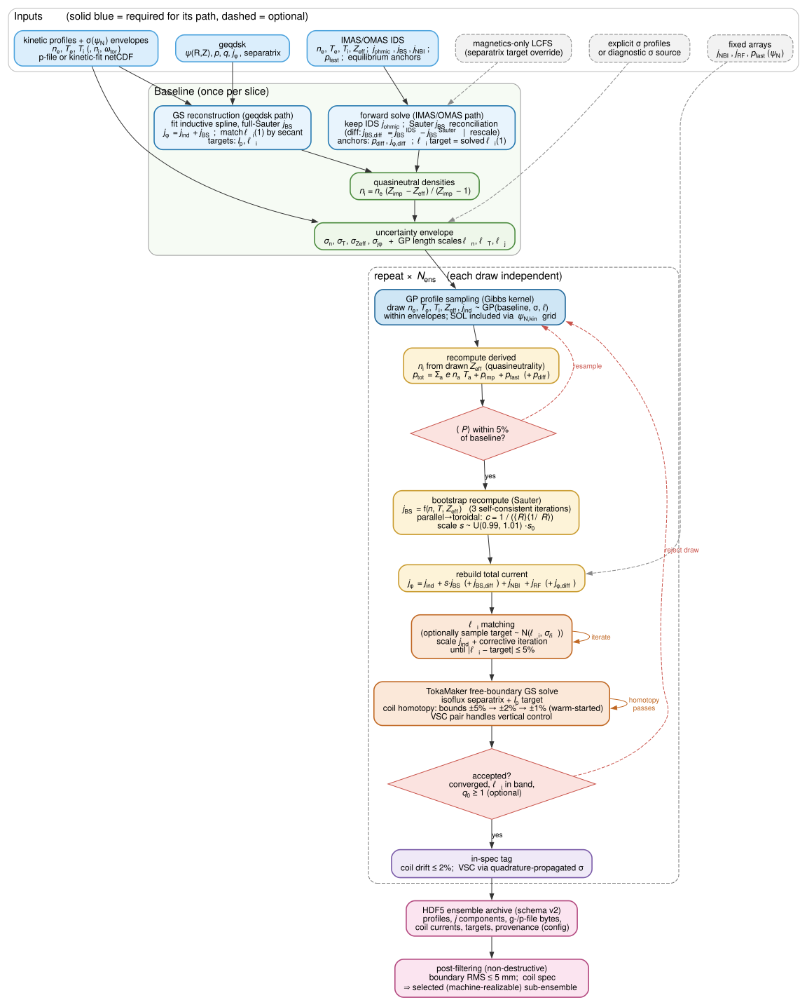

# bouquet

[](https://doi.org/10.5281/zenodo.19398541)
[](https://github.com/d-burg/bouquet/actions/workflows/tests.yml)


**BO**otstrap **U**ncertainty **QU**antified **E**quilibrium **T**oolkit

GP-sampled perturbed equilibria for uncertainty quantification with TokaMaker.

Bouquet generates families ("bouquets") of perturbed tokamak equilibria from a
baseline kinetic equilibrium by drawing correlated profile perturbations from
Gaussian process regression posteriors, solving the Grad–Shafranov equation for
each sample, and archiving all results to a single self-describing HDF5
database.

Two baseline sources are supported through one class-based API
(`bouquet.Bouquet`):

- **Reconstruction** — a g-file plus kinetic profiles (Osborne p-file or an
  IDA netCDF); bouquet reconstructs the equilibrium and separates the
  inductive / bootstrap current itself.
- **IMAS/OMAS** — an IMAS data-dictionary JSON (e.g. FUSE output) that already
  carries the separated currents (`j_ohmic` / `j_bootstrap`), kinetic
  profiles, and fast-ion pressure; no reconstruction step is needed.

---

## Citation

If you use Bouquet in your research, please cite (see also
[`CITATION.cff`](CITATION.cff) / the "Cite this repository" button):

> Burgess, D., Hansen, C. (2026). Bouquet (v0.2.0). Zenodo. https://doi.org/10.5281/zenodo.19398541


## Workflow at a glance

The physics workflow — what happens to the profiles and equilibrium
quantities from inputs to the archived ensemble:

[](https://d-burg.github.io/bouquet/flowchart/)

The same page also hosts the **full logic map** — every config knob, decision
gate, and artifact (550+ nodes), extracted from the code with a `file:line`
anchor on every node:
**[→ explore interactively](https://d-burg.github.io/bouquet/flowchart/)**
([source + regeneration](docs/flowchart/)).


## Contents

- [Features](#features)
- [Installation](#installation)
- [Quick Start](#quick-start)
- [Workflow Overview](#workflow-overview)
- [IO Modules](#io-modules)
- [Plotting](#plotting)
- [HDF5 Archive](#hdf5-archive)
- [Parallel Generation](#parallel-generation)
- [Timeseries Sweeps](#timeseries-sweeps)
- [Examples](#examples)
- [Testing](#testing)
- [Coil Constraint Handling](#coil-constraint-handling)
- [Architecture and Assumptions](#architecture-and-assumptions)
- [API Reference](#api-reference)

---

## Features

- **Gaussian Process perturbation** of kinetic profiles (n_e, T_e, n_i, T_i)
  with user-supplied uncertainty envelopes and spatially-varying correlation
  lengths (Gibbs non-stationary kernels).
- **Z_eff-consistent density scheme**: each draw perturbs {n_e, T_e, T_i,
  Z_eff} and *derives* the main-ion density from quasi-neutrality with a
  single effective impurity charge, so n_i / n_z / Z_eff stay mutually
  consistent in every sample.
- **Dual-grid kinetic profiles**: kinetic profiles can be specified on a
  separate grid (`psi_N_kinetic`) that extends past ψ_N = 1 into the SOL.
  GPR sampling includes the SOL; equilibrium solving uses the confined region.
- **Corrective j_phi iteration**: adaptive Newton iteration (2–8 steps) drives
  TokaMaker's output j_phi to match the target profile, compensating for
  geometry coupling in the jphi-linterp ↔ GS solve round-trip.
- **Bootstrap-aware edge reconstruction**: Sauter bootstrap spike is preserved
  in all reconstructions regardless of whether the input geqdsk includes a
  bootstrap model. Profile classifier (`H_mode`, `Lmode_like_jphi`, `L_mode`)
  with edge spike alignment metrics.
- **Pressure and l_i matching**: perturbed profiles are constrained to match
  the baseline volume-averaged pressure (default `p_thresh=0.05`, i.e. 5%,
  calibrated to DIII-D's actual `<P>` measurement uncertainty) and internal
  inductance.
- **IMAS/OMAS input pipeline**: read FUSE `dd_sim.json` baselines directly
  (separated currents, kinetic profiles, fast-ion pressure, rotation) with
  parallel→toroidal current conversion and anisotropic fast-pressure
  reduction (`bouquet.physics`).
- **Validated workflow presets**: `from_geqdsk` / `from_imas` auto-apply the
  workflow validated for each source path (`geqdsk-standard` /
  `imas-diff-c`), and a guard raises on known-bad knob combinations
  (`GenerationConfig.workflow="custom"` opts out for experiments).
- **Recon-anchor + adaptive l_i gate**: at sigma -> 0 the pipeline reproduces
  the reconstructed equilibrium to within recon's own residual (l_i within
  ~0.5% of target, X-pt within ~2 mm, bnd_RMS ~3-4 mm vs eqdsk).  See
  [`architecture.md` §3.3](architecture.md#33-li-matching-recon-anchor--adaptive-gate).
- **Progressive coil-bound homotopy**: per-coil hard bounds on TokaMaker's
  QP, applied in a warm-started multi-pass schedule so engineering-feasible
  tolerances (e.g. +/-2% on F-coils, +/-2% on the VSC pair) can be enforced
  even from a cold start.  Each draw is tagged `in_spec` per
  user-configurable thresholds; out-of-spec draws are still archived.  See
  [Coil Constraint Handling](#coil-constraint-handling) and
  [`architecture.md` §15](architecture.md#15-coil-constraint-handling-diii-d-reference).
- **Current decomposition**: explicit bootstrap (Sauter/Redl model) + inductive
  separation with iterative l_i convergence and corrective j_phi iteration.
- **Reconstruction quality metrics**: each reconstruction reports jphi_mode,
  spike alignment, core/edge j_phi RMS, l_i error, Ip error, and LCFS
  boundary RMS/max deviation.
- **Self-describing HDF5 archive (schema v2)**: bare dataset names with units
  in attrs, byte-perfect g-file/p-file payloads, filter flags, and full
  provenance — schema version, package version, and the exact JSON-serialized
  `BouquetConfig` that produced the file. See
  [`docs/archive-schema.md`](docs/archive-schema.md).
- **High-level archive reader** (`BouquetArchive`): walk scans, draws,
  profiles, and stored equilibria without hand-rolling any h5 traversal.
- **Process-parallel generation**: laptop `ProcessPoolExecutor` and SLURM
  job-array backends over one shard runner, with cross-worker baseline
  verification and slice-decorrelated seeding.
- **COCOS-aware GEQDSK reader** with full flux-surface geometry (κ, δ,
  squareness), safety factor, current density, and exact outboard-midplane
  profiles — all computed independently of external tools.
- **COCOS conversion and Bt/Ip flip**: convert g-file data between any two
  COCOS conventions (`cocosify`) and reverse the toroidal field / plasma
  current directions (`flip_Bt_Ip`), with save-to-disk and HDF5 round-trip
  support.  Verified field-by-field against OMFIT's `OMFITgeqdsk`.
- **P-file reader/writer** supporting the Osborne format with 24+ profile
  types, diamagnetic rotation computation, E×B decomposition, and radial
  electric field; plus an impurity-CER reader and radial-force-balance E_r
  (`read_ida_cer` / `radial_field_from_cer`).
- **Comprehensive plotting**: multi-panel kinetic, current, geometry, and
  rotation diagnostics from a single function call.

---

## Installation

```bash
# Clone the repository
git clone https://github.com/d-burg/bouquet.git
cd bouquet

# Install in development mode
pip install -e ".[dev]"
```

### Dependencies

| Package | Purpose |
|---------|---------|
| numpy | Array operations |
| scipy | Interpolation, GPR kernels, optimisation |
| matplotlib | Plotting |
| h5py | HDF5 database I/O |
| [TokaMaker](https://github.com/hansec/OpenFUSIONToolkit) | Grad–Shafranov solver (required for equilibrium generation, not for IO/plotting) |

TokaMaker must be installed separately following the
[OpenFUSIONToolkit instructions](https://github.com/hansec/OpenFUSIONToolkit).
The IO and plotting modules work without TokaMaker.

Two helpers make setups portable across machines: `bq.add_oft_to_path()`
resolves the OFT install (`OFT_PYTHONPATH` env var → known locations →
walk-up) and `bq.find_mesh()` locates the TokaMaker mesh (`BOUQUET_MESH` env
var → walk-up → the bundled example mesh). Both raise with the full list of
locations tried, so failures are actionable on a new machine.

---

## Quick Start

### Reading equilibrium files (no TokaMaker required)

```python
from bouquet import GEQDSKEquilibrium, read_pfile

# Load a g-file
eq = GEQDSKEquilibrium("g123456.01000")
print(f"Ip = {eq.Ip/1e6:.3f} MA")
print(f"q95 = {eq.q_profile[-1]:.2f}")
print(f"li(1) = {eq.li['li(1)']:.3f}")

# Flux-surface-averaged current density (from p' and FF')
j_phi = eq.j_tor_averaged            # <Jt/R> / <1/R>
j_phi_direct = eq.j_tor_averaged_direct  # literal <Jt> from GS equation

# Access flux-surface geometry
geo = eq.geometry
print(f"Elongation at boundary: {geo['kappa'][-1]:.2f}")

# Exact outboard-midplane profiles
mid = eq.midplane
print(f"R_mid at boundary: {mid['R'][-1]:.4f} m")

# Load a p-file (profiles are attributes; grids/derivatives via helpers)
pf = read_pfile("p123456.01000")
ne = pf.ne                            # profile values
psi = pf.psinorm_for("ne")            # its psi_N grid
dne = pf.derivative_for("ne")         # its stored derivative
```

### COCOS conversion and Bt/Ip flip

```python
from bouquet import GEQDSKEquilibrium, read_geqdsk

# Load as COCOS 7, convert to COCOS 1, flip Bt/Ip
eq = read_geqdsk("g123456.01000", cocos=7)
eq.cocosify(1)       # in-place; use copy=True to get a new object
eq.flip_Bt_Ip()      # in-place

# Save to disk or serialise for HDF5
eq.save("modified.geqdsk")
raw_bytes = eq.to_bytes()          # for HDF5 storage
eq2 = GEQDSKEquilibrium.from_bytes(raw_bytes, cocos=1)  # reconstruct
```

### Generating a bouquet (requires TokaMaker)

The `Bouquet` class drives the full pipeline: solver setup → baseline →
perturbed draws → filtering → export. TokaMaker must be importable
(`bq.add_oft_to_path()`, or `PYTHONPATH` to your OpenFUSIONToolkit build).

```python
import bouquet as bq

# --- Reconstruction source: g-file + kinetic profiles (p-file or IDA .cdf)
b = bq.Bouquet.from_geqdsk(
    "g123456.01000",
    profiles="p123456.01000",     # p-file or IDA .cdf (auto-detected)
    mesh=bq.find_mesh(),
    n_draws=20, header="my_run",
)
b.reconstruct()                   # GS reconstruction + quality summary
b.generate()                      # perturbed draws -> my_run.h5
b.filter()                        # mark the machine-realizable subset
b.export()                        # my_run_selected.h5

# --- IMAS/OMAS source: FUSE dd_sim.json (already-separated currents)
b = bq.Bouquet.from_imas(
    "dd_sim.json", mesh=bq.find_mesh(),
    time=2.1, n_draws=20, header="my_imas_run",
)
b.run()                           # setup -> baseline -> generate -> filter -> export
```

`b.prepare()` is the source-agnostic form of the baseline stage
(`reconstruct()` is its alias on the reconstruction path), and
`b.describe()` prints the current configuration showing only non-default
knobs. Tune knobs through the config sub-objects before `generate()`:

```python
b.uncertainty.ne_scalar_sigma = 0.05   # flat 5% envelope when no IDA sigmas
b.uncertainty.jphi_scalar_sigma = 0.10
b.generation.n_equils = 50
b.generation.l_i_tolerance = 0.05      # FRACTION of target (0.05 = 5%)
b.generation.seed = 1234
```

Full control (every knob, both sources) goes through `bq.BouquetConfig` —
see the dataclass docstrings in `bouquet/config.py`. Configs serialize to
JSON (`cfg.to_dict()` / `BouquetConfig.from_dict()`) and every archive
stores the exact config that produced it (`bq.load_config("my_run")`).
The legacy functional API (`reconstruct_equilibrium` / `generate_bouquet`)
remains available for existing scripts. Note all tolerance arguments are
**fractions** (e.g. `l_i_tolerance=0.01`), not percentages.

```python
# Visualise any run from its HDF5 archive
from bouquet import plot_bouquet, plot_traces
plot_bouquet("my_run.h5", scan_key=0, mode="all")
plot_traces("my_run.h5", scan_key=0)
# ...or hand the run object itself to any reader/plotter:
plot_bouquet(b)
```

### Reading an archive back

```python
ar = bq.BouquetArchive("my_run.h5")     # or bq.BouquetArchive(b)
ar.scan_keys                            # e.g. ['0']
sc = ar["0"]
sc.indices, sc.baseline                 # draw indices (gap-tolerant), baseline dict
for d in sc.selected:                   # DrawViews passing the filters
    print(d.count, d.li1, d.flags)
eq = sc[3].equilibrium()                # parsed GEQDSKEquilibrium from stored bytes
sc[3].extract("out/", formats=("geqdsk", "pfile"))   # write the raw files

cfg = bq.load_config("my_run")          # the exact BouquetConfig that made it
```

### Exporting draws

Hand the ensemble off to codes that don't read the HDF5 archive. Two
targets: a **per-draw file bundle** (g-file / p-file / self-describing
profiles JSON) or **one IMAS/OMAS `equilibrium` + `core_profiles` IDS per
draw**. `selection` is `"selected"` (the in-spec subset, default) or
`"all"`.

```python
# --- File bundle: geqdsk + a self-describing profiles JSON per draw
b.export_bundle("bundle/", formats=("geqdsk", "profiles"))   # -> {draw: {fmt: path}}
# equivalently from an archive on disk, honouring the same selection:
bq.BouquetArchive("my_run.h5")["0"].extract("bundle/", formats=("geqdsk", "pfile"))

# --- IMAS/OMAS IDS per draw (IMAS/OMAS source only)
b.export_ids("ids/", fidelity="exact")            # -> [path, ...]
```

The profiles JSON is source-agnostic and carries everything needed to
rebuild the state elsewhere: the perturbed profiles + their units, scalar
diagnostics (`l_i`, `I_p`, …), coil currents by name, and the captured
flux-surface-averaged geometry (`eq_fsa`).

**IDS current-split fidelity.** The toroidal current `j_tor` in the IDS is
always exact. The *parallel* split IMAS stores (`j_total` / `j_ohmic` /
`j_bootstrap` = ⟨**j**·**B**⟩/B₀) needs a flux-surface geometry factor to
convert from bouquet's toroidal components, and `fidelity` picks where that
factor comes from:

| `fidelity` | Parallel split uses | When |
|---|---|---|
| `"exact"` | the draw's **own** captured `eq_fsa` geometry (`toroidal_to_parallel`) | draws deviate from the baseline; the split must track each perturbed equilibrium |
| `"reconstruct"` | the baseline template ratio `c = j_tor/j_total` | exact only when a draw's flux geometry matches the baseline's |
| `"auto"` *(default)* | exact when the `eq_fsa` block is present, else reconstruct | — |

The `eq_fsa` block is captured at generate time from the live TokaMaker
object (`GenerationConfig.capture_live_eq=True`, on by default), so a
freshly generated archive supports `"exact"` out of the box. Across the
ensemble the two paths differ by a few percent per draw — the point of
capturing the live geometry rather than reusing the baseline's.

---

## Workflow Overview

```
Baseline: g-file + profiles (p-file / IDA), or IMAS/OMAS JSON
        │
        ▼
┌───────────────────────┐
│  Define uncertainties  │  IDA sigmas / synthetic_ida_sigma()
│  σ_ne, σ_Te, σ_Zeff, … │  or flat fractional envelopes
└───────────┬───────────┘
            ▼
┌───────────────────────┐
│  Draw GPR perturbation │  GPRProfilePerturber
│  ne±δne, Te±δTe, Zeff… │  (Gibbs kernel, monotonicity enforced)
└───────────┬───────────┘
            ▼
┌───────────────────────┐
│  Derive n_i (quasi-    │  Z_eff-primary density scheme
│  neutrality) + p_total │  + fixed p_fast / j_NBI / j_RF
└───────────┬───────────┘
            ▼
┌───────────────────────┐
│  Rebuild j_phi         │  j_ind (GPR) + j_BS (Sauter, per-draw)
│  Match pressure & li   │  + fixed anchors; secant li iteration
└───────────┬───────────┘
            ▼
┌───────────────────────┐
│  Solve Grad–Shafranov  │  TokaMaker + coil-bound homotopy
│  Export g-file bytes   │
└───────────┬───────────┘
            ▼
┌───────────────────────┐
│  Store to HDF5 (v2)    │  profiles + raw bytes + diagnostics
│  + provenance          │  + config_json / schema_version
└───────────────────────┘
```

### What is perturbed vs. held fixed

| Quantity | Perturbed? | Notes |
|----------|:----------:|-------|
| n_e, T_e, T_i | ✓ | Drawn from GPR posterior |
| Z_eff | ✓ | Active channel (default on via `zeff_scalar_sigma`) |
| n_i, n_z (impurity) | derived | Quasi-neutrality with the drawn Z_eff (`impurity_Z`) |
| Total pressure (p_tot) | ✓ | Recomputed from perturbed kinetics |
| Bootstrap current (j_BS) | ✓ | Sauter model recomputed per draw (`recalculate_j_BS`) |
| Inductive current (j_ind) | ✓ | GPR-perturbed + scaled to match l_i |
| Coil currents | ✓ | Adjusted by TokaMaker within homotopy bounds |
| Aux channels (ω_tor, E_r, χ_e, χ_i) | optional | Switchboard: perturbed + stored when sigmas supplied (passive) |
| p_fast, j_NBI, j_RF | ✗ | Fixed additive components, never perturbed |
| Equilibrium anchors (p_diff, jphi_diff, jBS_diff) | ✗ | Fixed offsets applied to baseline AND every draw |

### Scope of the in-spec ensemble (what it is, and isn't)

The selected (in-spec) draws are a **realizability-filtered sensitivity
ensemble**, not a calibrated Bayesian posterior. Read them as *"equilibria
consistent with the stated kinetic-profile uncertainty that remain broadly
machine-realizable"* — useful for sensitivity and what-if analysis. They are
**not** a posterior you should quote calibrated probabilistic confidence
intervals from. Specifically:

- Only the **kinetic profiles** are sampled (the prior); the equilibrium is
  forward-solved with the **boundary held** and the **coils left to drift**.
  Pinning the coils instead (and letting the boundary move) gives a *different*
  ensemble — neither is "the" posterior; the choice privileges the
  magnetics-measured boundary.
- Selection is a **hard threshold** on coil drift and boundary RMS (approximate
  Bayesian computation), **not** a likelihood weighting by the real measurement
  covariances, and there is no joint correlation structure between the perturbed
  quantities and the constraints.
- The coil thresholds (esp. the VSC metric below) are **engineering heuristics**,
  not the true measurement/control uncertainties — see the VSC note for the
  specific assumption and its limits.

A genuinely calibrated posterior would replace the hard cut with soft likelihood
weighting using the joint coil/magnetics/kinetics covariances; that is future
work.

---

## IO Modules

### GEQDSK Reader

```python
from bouquet import GEQDSKEquilibrium

eq = GEQDSKEquilibrium("g123456.01000", cocos=1)
```

| Property / Method | Description |
|-------------------|-------------|
| `psi_N` | Normalised poloidal flux grid (0 → 1) |
| `psi_N_RZ` | 2-D normalised poloidal flux on the (R, Z) grid |
| `psi_axis`, `psi_boundary` | Axis and boundary flux (Wb) |
| `Ip` | Plasma current (A, sign-corrected) |
| `q_profile` | Safety factor on psi_N |
| `j_tor_averaged` | `<Jt/R>/<1/R>` — standard convention (OMFIT, TRANSP) |
| `j_tor_averaged_direct` | Literal `<Jt>` from p' and FF' (GS equation) |
| `geometry` | Dict with R, Z, a, κ, δ, squareness per surface |
| `midplane` | Exact outboard-midplane R, Bp, Bt, Btot |
| `rhovn` | Normalised toroidal flux coordinate |
| `li` | Internal inductance dict (li(1), li(2), li(3), …) |
| `betas` | Plasma beta values (beta_t, beta_p, beta_n) |
| `cocos` | Current COCOS convention index |
| `cocosify(out)` | Convert between COCOS conventions (in-place or copy) |
| `flip_Bt_Ip()` | Reverse Bt and Ip signs (in-place or copy) |
| `save(path)` | Write modified g-file to disk |
| `to_bytes()` | Serialise to bytes for HDF5 storage |
| `from_bytes()` | Construct from in-memory bytes |

COCOS conventions 1–8 and 11–18 are fully supported.  See
[`bouquet/io/GEQDSK_QUANTITIES.md`](bouquet/io/GEQDSK_QUANTITIES.md)
for a complete reference of every derived quantity.

### P-File Reader/Writer

```python
from bouquet import PFile, read_pfile

pf = read_pfile("p123456.01000")

# Access profiles (attributes), grids and derivatives (helpers)
ne = pf.ne
psi_grid = pf.psinorm_for("ne")
dne = pf.derivative_for("ne")

# Modify profiles
pf.set_profile("ne", new_psi, new_ne)

# Recompute derived quantities
pf.compute_pressure()
pf.compute_diamagnetic_rotations(psi_Wb)
pf.compute_rotation_decomposition(R=R_mid, Bp=Bp_mid, Bt=Bt_mid, psi=psi_Wb)

# Serialise
raw_bytes = pf.to_bytes()
pf2 = PFile.from_bytes(raw_bytes)
```

Supported profiles: `ne`, `te`, `ni`, `ti`, `nb`, `pb`, `ptot`, `nz1`,
`omeg`, `omegp`, `omgvb`, `omgpp`, `omgeb`, `er`, `ommvb`, `ommpp`,
`omevb`, `omepp`, `kpol`, `omghb`, `vtor1`, `vpol1`, and more.

### IDA netCDF reader

`read_ida()` loads IDA `.cdf` kinetic fits (both the direct `*_err` and
ensemble posterior layouts) as an `IDAProfiles` bundle — the same file
supplies the sigma envelopes when used as an uncertainty source.
`read_ida_cer()` loads impurity CER channels, and
`radial_field_from_cer()` evaluates the impurity radial force balance
E_r (with propagated uncertainty) from them.

---

## Plotting

All plotting functions return `(fig, axes)` and accept a `Bouquet`, a
`BouquetArchive`, a bare header, or a `.h5` path interchangeably.

### Available functions

```python
from bouquet import (
    plot_bouquet,               # Full overview (dispatches on stored source kind)
    plot_traces,                # l_i, Ip, boundary deviation traces
    plot_geqdsk_bouquet,        # 3×3 grid: pressure, current, q, geometry, li, flux surfaces
    plot_pfile_bouquet,         # Multi-panel: densities, temperatures, rotations
    plot_coil_currents,         # Bar chart of coil currents
    plot_tokamaker_comparison,  # TokaMaker vs source geqdsk comparison
    plot_input_vs_recon,        # Baseline-vs-reconstruction gate figure
    draw_kinetic_profiles,      # ne, Te, ni, Ti on existing axes
    draw_pressure_profiles,     # Pressure + perturbed ensemble
    draw_jphi_total,            # j_phi with uncertainty band
    draw_jphi_components,       # Bootstrap + inductive decomposition
)
```

### Selecting scans and draws

Archives are organised by `scan_key` (a user-chosen label per bouquet —
a time in ms, a beta value, …). Passing a `scan_key` that does not exist
raises a `KeyError` listing the available keys.

```python
# All draws for scan_key=0 (+ baseline in black)
plot_pfile_bouquet(h5path="run.h5", scan_key=0, x_coord="psi_N")

# A single specific equilibrium
plot_pfile_bouquet(h5path="run.h5", scan_key=0, count=3, x_coord="psi_N")

# Discover available scan keys
from bouquet import discover_scan_keys
discover_scan_keys("run.h5")  # e.g. ['0', '2000', '2200']

# Plot only the filter-selected subset
plot_bouquet("run.h5", scan_key=0, selection="selected")
```

### Styling

In HDF5 mode, the **baseline** is plotted in black (background, zorder=1) and
**perturbed** equilibria in colour (foreground, zorder=3, alpha=0.65). In
file-list mode (no baseline/perturbed distinction), all entries use the `tab10`
colormap uniformly.

---

## HDF5 Archive

Bouquet writes a **schema-v2** self-describing archive — bare dataset names
with units in attrs, fixed `eqdsk`/`pfile` byte payloads, non-destructive
filter flags, and full provenance (`schema_version`, `bouquet_version`, and
the exact `config_json` per scan). The complete layout is documented in
[`docs/archive-schema.md`](docs/archive-schema.md); the code-level source of
truth is [`bouquet/schema.py`](bouquet/schema.py).

```
run.h5                       attrs: schema_version=2, bouquet_version, created
└── scan/<scan_key>/         one group per scan point (+ config_json)
    ├── _baseline/           profiles, sigmas, raw eqdsk/pfile bytes, targets
    └── <count>/             one group per accepted draw (gaps = rejections):
                             profiles, eqdsk/pfile bytes, coil currents,
                             l_i(1)/l_i(3), in-spec metrics, filter flags
```

Prefer `BouquetArchive` (see [Quick Start](#reading-an-archive-back)) or the
functional readers over raw `h5py`:

```python
from bouquet import (
    load_equilibrium, load_baseline_profiles,
    discover_scan_keys, count_equilibria, list_equilibrium_indices,
    select_indices, read_filter_flags, export_filtered,
    write_provenance, load_config,
)

for sk in discover_scan_keys("run.h5"):
    n = count_equilibria("run.h5", scan_key=sk)
    print(f"scan_key={sk}: {n} equilibria")

data = load_equilibrium("run", count=0, scan_key="0")
cfg = load_config("run", scan_key="0")      # reproduce the run
```

Pre-v2 archives (written before 2026-07) are detected by the missing
`schema_version` attr: `BouquetArchive` opens them with a warning and
`load_equilibrium` raises a clear error — regenerate them with the current
package.

---

## Parallel Generation

Draws are embarrassingly parallel, and `OFT_env` is a per-process singleton —
so parallelism is across **processes**, one single-threaded TokaMaker per
physical core (`nthreads=1` is the validated regime: bit-reproducible
baselines, no OpenMP li jitter, no DLSODE hangs).

```python
import bouquet as bq

cfg = b.config                       # any BouquetConfig
summary = bq.parallel_generate(      # laptop: ProcessPoolExecutor (spawn)
    cfg, n_workers=None,             # None -> physical core count
    threads_per_worker=1, seed=1234,
    backend="laptop",
)

paths = bq.parallel_generate(        # cluster: emit SLURM job-array + merge
    cfg, n_workers=32, seed=1234, threads_per_worker=1,
    backend="slurm",
    slurm=dict(out_dir="slurm_jobs", job_name="my_run",
               setup=["export OFT_PYTHONPATH=/path/to/OFT/python"]),
)
# then: bash slurm_jobs/my_run_submit.sh   (works from any CWD)
```

Each worker runs the ordinary serial pipeline on its shard and writes
`{header}_w{i}.h5`; the merge concatenates them into `{header}.h5`,
**verifying every shard converged to the same baseline** before copying, and
stamps the run-level config provenance. Worker seeds derive from
`SeedSequence(seed, worker_id, scan_key)`, so timeseries slices swept with
one seed are decorrelated. Parallel draws are statistically equivalent to —
but not bit-identical with — a serial run of the same seed.

---

## Timeseries Sweeps

One IMAS/OMAS file often holds many time slices. `run_slices` sweeps them
into a single archive, one `scan_key` per slice, reusing the solver:

```python
b = bq.Bouquet.from_imas("dd_sim.json", mesh=bq.find_mesh(), n_draws=20,
                         header="my_sweep")
b.setup_solver()
metrics = b.run_slices(times=[2.10, 2.20, 2.30],
                       scan_keys=[2100, 2200, 2300])
# -> {2100: {n_all, n_selected, li, Ip, ...}, ...} all in my_sweep.h5
```

---

## Examples

Example notebooks are in the `examples/` directory:

| Notebook | Description |
|----------|-------------|
| `D3D-like/bouquet_D3Dlike_geqdsk_example.ipynb` | Class-API walkthrough on the synthetic D3D-like g-file + p-file baseline |
| `D3D-like/bouquet_D3Dlike_omas_example.ipynb` | Class-API walkthrough on the synthetic IMAS/OMAS (FUSE-style) baseline, incl. a timeseries sweep |
| `D3D-like/bouquet_D3Dlike_parallel_IMAS_example.ipynb` | Process-parallel generation (laptop pool + SLURM emission) over the OMAS timeseries |
| `D3D-like/bouquet_D3Dlike_systematics.ipynb` | Backend systematics: replaying draws through the solve pipeline to decompose pressure- vs current-driven responses |
| `D3D-like/` | The synthetic, shareable D3D-like fixtures (g-file, p-file, OMAS JSON, mesh) + generation recipe |
| `COCOS_Bt_Ip/cocos_and_save_example.ipynb` | COCOS conversion, Bt/Ip flip, save to disk/HDF5 |
| `COCOS_Bt_Ip/omfit_cocos_comparison.ipynb` | Field-by-field validation against OMFIT (requires `omfit_classes`) |
| `omfit-comparison/` | Verification against OMFIT reference values |

See `examples/README.md` for environment setup and runtimes.

---

## Testing

```bash
pytest tests/
```

Tests cover:

- **`test_core.py`** — Uncertainty envelopes, H-mode profile generation
- **`test_geqdsk.py`** — GEQDSK parsing, COCOS conventions, flux-surface
  geometry, current density, safety factor
- **`test_pfile.py`** — P-file parsing, rotation decomposition, byte
  serialisation round-trip
- **`test_physics.py`** — Parallel→toroidal current conversion, fast-pressure
  isotropization, radial-force-balance E_r
- **`test_config.py`** — Config JSON round-trip + archive provenance
- **`test_archive.py`** — `BouquetArchive` reader, schema-v2 + legacy-name
  resolution
- **`test_ida.py`** — IDA netCDF reader (direct + ensemble layouts), CER
- **`test_golden_bouquet.py`** — Golden-fixture replay of filtering,
  boundary extraction, and HDF5 round-trips
- **`test_systematics.py`** — Solver-marked integration tests (excluded by
  default; run with `pytest -m solver` and a working TokaMaker)

Test data (sample g-files and p-files) is in `tests/data/`; golden HDF5
fixtures are in `tests/golden/`. CI runs the fast suite on two dependency
sets (pinned floor + latest) so upstream numpy/scipy changes surface as
their own signal — see [`docs/CI.md`](docs/CI.md).

---

## Coil Constraint Handling

Forward-mode perturbed equilibria must keep coil currents close to the
reconstructed baseline to be engineering-realistic.  Bouquet enforces this
via per-coil hard bounds on the TokaMaker QP, with a **progressive
homotopy** that warm-starts each tighter pass from the prior pass's
converged psi.  Each draw is tagged with an `in_spec` flag based on
class-specific tolerances.

### Three coil classes (DIII-D reference)

| Class | Members | Baseline range | Spec interpretation |
|---|---|---|---|
| Non-VSC F-coils | F1A-F8A, F1B-F8B | 35-180 kA | Tight relative drift (`inspec_F_max`, default 2.5%) |
| VSC pair | F9A, F9B | 35-50 kA | Wider relative drift (`inspec_VSC_max`, default 10%) for vertical control |
| E-coils | ECOILA, ECOILB | 0.5-1 kA | Bounded by absolute floor (`coil_drift_floor_A`, default 50 A) -- excluded from `in_spec` because their small baselines make relative bounds engineering-meaningless |

The **50 A floor** is calibrated to DIII-D's actual current-control
tolerance budget: ~30-50 A power-supply ripple + ~30-50 A Rogowski +
integrator noise + ~10-100 A un-modelled vessel coupling.  See
[architecture.md §15](architecture.md#15-coil-constraint-handling-diii-d-reference)
for the full source-cited tolerance budget.

### VSC drift metric (anti-series pair)

F9A/F9B are an **anti-series VSC pair**: they move together as a common-mode
current `±ΔI` that controls the plasma's vertical position. On vertically-
sensitive equilibria one of the pair routinely sits near a **current
zero-crossing** (e.g. F9A ≈ −16 kA while F9B ≈ +93 kA). The naive per-coil
metric `|ΔI| / |I_baseline|` then divides a *benign* common-mode current by
F9A's near-zero baseline and reports a spurious large drift — e.g. a 400 A
common-mode reads as 2.4% on F9A but only 0.4% on F9B, falsely rejecting the
draw. This is the same small-baseline pathology that excludes the E-coils
above, and it silently tanks the in-spec yield on any peaked/vertically-
unstable baseline.

Bouquet scores the VSC **selection** metric by decomposing the pair into its
two physical degrees of freedom and gating their changes against the
**error-propagated** measurement uncertainty (`_vsc_channel_drift_pct` in
`TokaMaker_interface.py`):

```
I_cm = (F9A − F9B)/2   # common-mode = vertical control
I_df = (F9A + F9B)/2   # differential = shaping residual

# both channels are linear combos of two independently-measured coils, so their
# uncertainty propagates IN QUADRATURE from the per-coil uncertainties:
sigma_VSC = sqrt(|F9A|² + |F9B|²) / 2  + denom_floor       # (= offset/gain)
drift_VSC = 100 · max(|ΔI_cm|, |ΔI_df|) / sigma_VSC
```

- **The tolerance is built from the coil magnitudes, not the channel baselines**,
  so it never goes near zero. Gating a channel against *its own* baseline blows
  up whenever that baseline is small — and there are **two** such cases on real
  equilibria: a near-zero *coil* (F9A ≈ −16 kA on the FUSE/IMAS baseline, which
  breaks the naive per-coil `|ΔI|/|I_base|`) **and** a near-zero *common-mode
  baseline* (a co-current pair, e.g. the geqdsk baseline F9A ≈ F9B ≈ −65 kA,
  where `(F9A−F9B)/2 ≈ 7 kA`). The propagated `sigma_VSC` is immune to both,
  because a small difference of two large, imprecisely-known currents is itself
  imprecisely known: `σ` comes from the coil errors, not the (small) channel
  value. (An earlier larger-pair and a channel-baseline version each fixed only
  one of the two cases; the quadrature fixes both.)
- **The quadrature** (sum of squares, ÷2) is exactly the propagation of two
  *independent* transducer errors through the ±½ channel coefficients; the
  differential channel still catches a genuinely asymmetric/same-sign excursion.
- **`denom_floor`** (`_COIL_DRIFT_DENOM_FLOOR_A`, default 10 kA = offset/gain)
  carries the additive **measurement + eddy-current** uncertainty: real
  coil-current noise is `gain·|I| + offset`, where the offset (sensor zero +
  vessel/passive-structure eddy contribution) is *current-independent*. At the
  2% spec this floor ≈ a 200 A additive tolerance. **ASSUMPTION:** no published
  DIII-D coil-current measurement-noise figure was found (Rogowski/PF
  measurement is ~0.1–1% in the literature; eddy adds a current-independent
  term), so this is a deliberately conservative placeholder — replace the
  constant with the real transducer offset + eddy-equivalent figure when
  available.

This is the *measurement-uncertainty* reading ("states consistent with the
measured VSC currents"). The non-VSC F-coils keep the relative `|ΔI|/|I_base|`
metric (their uncertainty is gain-dominated). If the binding constraint is
instead the VSC power-supply
**control authority** (not measurement uncertainty), gate `|ΔI_cm|` against that
amp budget directly — same structure, different number.

### Progressive homotopy

The class API drives the homotopy through `GenerationConfig`
(`homotopy_passes`, `coil_drift`, `coil_drift_hard_factor`, `inspec_F_max`,
`inspec_VSC_max`); the equivalent functional-API call is:

```python
diagnostics = generate_bouquet(
    mygs, psi_N, n_equils, "my_run",
    result['j_phi_fit'],
    ne, te, ni, ti,
    sigma_ne, sigma_te, sigma_ni, sigma_ti, sigma_jphi,
    n_ls, t_ls, j_ls, Ip_target, l_i_target, Zeff,
    input_jinductive=result['j_inductive_fit'],
    # Progressive bounds: each tuple is (drift_F_bare, drift_VSC_channel)
    # Total F9A/F9B drift = drift_F_bare + drift_VSC_channel
    homotopy_passes=[
        (0.05, 0.10),   # Pass 1: loose start
        (0.02, 0.05),   # Pass 2: intermediate
        (0.01, 0.01),   # Pass 3: strict +/-2% on F9 total
    ],
    inspec_F_max=0.02,      # in_spec if max non-VSC F-drift <= 2%
    inspec_VSC_max=0.02,    # in_spec if max VSC drift <= 2%
    p_thresh=0.05,          # accept GPR draws within 5% of baseline <P> (fraction)
)
```

Each tighter pass warm-starts from the prior pass's converged psi.  On
infeasibility the homotopy rolls back to the last successful pass and
re-solves to restore mygs's internal state.  Per-draw H5 attributes
(`homotopy_pass`, `max_F_drift_pct`, `max_VSC_drift_pct`, `in_spec`,
`inspec_F_max`, `inspec_VSC_max`) let you filter the bouquet downstream
without re-running anything.

Out-of-spec draws are still archived; just filter on the `in_spec`
attribute when you query the H5.

### Sigma -> 0 reproducibility

The pipeline is designed so that at `sigma=0` (no kinetic perturbation)
the output reproduces the reconstructed equilibrium to within recon's
own residual: l_i within ~0.5% of target, X-pt within ~2 mm of recon,
boundary RMS ~3-4 mm vs eqdsk (recon's own bnd_RMS is 2.84 mm on
the DIII-D reference discharge).  This requires the recon-anchor solve in
`perturb_kinetic_equilibrium` (replacing SWB's seed-based inductive
with recon's `j_inductive_fit`) and a post-anchor `l_i` tolerance gate.
See [architecture.md §3.3](architecture.md#33-li-matching-recon-anchor--adaptive-gate).

---

## Architecture and Assumptions

A detailed document covering all physics assumptions, numerical approximations,
coordinate conventions, known limitations, and planned future work is maintained
in [`architecture.md`](architecture.md). Key topics include:

- COCOS sign conventions
- Quasi-neutrality handling (Z_eff-primary density scheme)
- Current decomposition (Sauter bootstrap model)
- Rotation profile computation (exact midplane, Savitzky–Golay smoothing for ω_HB)
- Numerical floors for axis/edge singularities
- Pressure matching (default 5%, calibrated to DIII-D `<P>` uncertainty) and l_i iteration tolerances
- **[Coil constraint handling (DIII-D reference)](architecture.md#15-coil-constraint-handling-diii-d-reference)**: tolerance budget, progressive homotopy, in_spec criterion
- Unit conventions (bouquet SI vs. p-file units)

---

## API Reference

### Class API (recommended)

| Class / Function | Description |
|------------------|-------------|
| `Bouquet` | Stateful driver: `setup_solver` → `prepare`/`reconstruct` → `generate` → `filter` → `export` (or just `.run()`) |
| `Bouquet.from_geqdsk()` / `Bouquet.from_imas()` | Minimal constructors for the two baseline sources (auto-apply the validated workflow preset) |
| `Bouquet.describe()` | Print the configuration (non-default knobs only) |
| `Bouquet.run_slices()` | Multi-slice IMAS sweep into one archive (one `scan_key` per slice) |
| `Bouquet.export_bundle()` / `Bouquet.export_ids()` | Per-draw file bundle (geqdsk / pfile / profiles JSON) or one IMAS/OMAS IDS per draw (`fidelity="exact"` uses captured `eq_fsa` geometry) |
| `Bouquet.archive` | The run's `BouquetArchive` |
| `BouquetConfig` | Top-level typed config (`SolverConfig`, `UncertaintyConfig`, `GenerationConfig`, `FilterConfig`, `FixedComponentsConfig`); JSON-serializable via `to_dict`/`from_dict` |
| `ReconstructionSource` / `ImasSource` | Baseline source definitions (g-file + profiles, or IMAS/OMAS JSON) |
| `Baseline` / `resolve_baseline()` | The common separated-current product every source resolves to |
| `read_ida()` / `read_imas_baseline()` | Standalone readers for IDA `.cdf` and FUSE `dd_sim.json` |
| `parallel_to_toroidal()` / `toroidal_to_parallel()` / `isotropize_fast_pressure()` | Current-convention (both directions, FSA-geometry aware) and fast-pressure physics reductions |
| `read_ida_cer()` / `radial_field_from_cer()` | Impurity CER channels + radial-force-balance E_r |
| `filter_coil_currents()` / `filter_boundaries()` / `export_filtered()` | Post-generation selection of the machine-realizable subset |
| `parallel_generate()` / `emit_slurm_script()` / `merge_archives()` | Process-parallel generation (laptop pool / SLURM job-array) |

### Archive

| Class / Function | Description |
|------------------|-------------|
| `BouquetArchive` | High-level reader: `ar[scan_key]` → `ScanView` → `DrawView` (profiles, flags, parsed equilibria, extraction) |
| `write_provenance()` / `load_config()` | Stamp / recover the exact `BouquetConfig` stored in an archive |
| `initialize_equilibrium_database()` | Create/open an archive (stamps `schema_version`) |
| `store_equilibrium()` / `load_equilibrium()` | Write / read one draw |
| `store_baseline_profiles()` / `load_baseline_profiles()` | Write / read the per-scan baseline |
| `load_eq_fsa()` | Read the per-draw live-equilibrium flux-surface-average block (`eq_fsa/`) |
| `discover_scan_keys()` / `count_equilibria()` / `list_equilibrium_indices()` | Archive introspection |
| `select_indices()` / `read_filter_flags()` | Filter-flag queries |

### Core Workflow (functional API)

| Function | Description |
|----------|-------------|
| `generate_bouquet()` | Batch driver: draw N perturbations, solve GS, archive to HDF5. Supports `psi_N_kinetic` for SOL-aware profiles. |
| `perturb_kinetic_equilibrium()` | Single perturbation: draw profiles, match pressure and l_i, corrective j_phi iteration |
| `reconstruct_equilibrium()` | Reconstruct one GS equilibrium from geqdsk + profiles with corrective iteration |
| `classify_jphi_profile()` | Classify edge current profile (H_mode / Lmode_like_jphi / L_mode) |
| `fit_inductive_profile()` | Smoothing spline + PCHIP fit of inductive current scaled to target l_i |

### Sampling

| Function / Class | Description |
|------------------|-------------|
| `GPRProfilePerturber` | Gaussian process profile perturbation engine |
| `generate_perturbed_GPR()` | One-call wrapper for perturbing a 1-D profile |
| `sigmoid_length_scale()` | Spatially-varying correlation length for Gibbs kernels |
| `verify_gpr_statistics()` | Monte Carlo validation of GPR sampling statistics |
| `calc_cylindrical_li_proxy()` | Fast cylindrical l_i proxy (no GS solve required) |

### Uncertainties

| Function | Description |
|----------|-------------|
| `new_uncertainty_profiles()` | Build 1-D uncertainty envelopes (power-law or flat+tail) |
| `synthetic_ida_sigma()` | IDA-shaped fractional sigma envelopes for synthetic studies |

### IO

| Class / Function | Description |
|------------------|-------------|
| `GEQDSKEquilibrium` | Full-featured GEQDSK reader with flux-surface analysis |
| `read_geqdsk()` | Parse a GEQDSK file (returns GEQDSKEquilibrium) |
| `bouquet.io.write_geqdsk()` | Write a raw g-file dict to disk (import from `bouquet.io`) |
| `PFile` | P-file reader/writer with rotation computation |
| `read_pfile()` | Parse a p-file (returns PFile object) |
| `IDAProfiles` / `IDACERProfiles` | IDA kinetic-fit and impurity-CER bundles |
| `write_imas_draw()` / `export_imas_drawset()` | Reconstruct one / all perturbed IMAS/OMAS IDS from an archive (top-level `bq.`; `fidelity` sets the parallel current-split source) |

### Environment

| Function | Description |
|----------|-------------|
| `add_oft_to_path()` | Make OpenFUSIONToolkit importable (`OFT_PYTHONPATH` → candidates → walk-up) |
| `find_mesh()` | Locate the TokaMaker mesh (`BOUQUET_MESH` → walk-up → bundled example) |

### Plotting

| Function | Description |
|----------|-------------|
| `plot_bouquet()` | Notebook-friendly overview plot (dispatches on stored source kind) |
| `plot_traces()` | l_i, Ip, and boundary deviation traces across equilibria |
| `plot_geqdsk_bouquet()` | GEQDSK multi-panel (9 panels: pressure, current, q, geometry, …) |
| `plot_pfile_bouquet()` | P-file multi-panel (densities, temperatures, rotations) |
| `plot_coil_currents()` | Coil current bar chart |
| `plot_tokamaker_comparison()` | TokaMaker reconstruction comparison |
| `plot_input_vs_recon()` | Baseline-vs-reconstruction gate figure |

---

## License

See [LICENSE](LICENSE).
